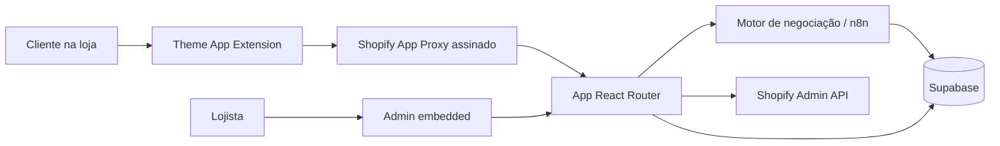

# Negotiator Prime

> Um app para Shopify que transforma pedidos de desconto em negociações orientadas por regras, sem abrir mão da margem definida pelo lojista.


[](https://github.com/MunhozVs/negotiator-prime/actions/workflows/ci.yml)

## O problema

Descontos aumentam a conversão, mas promoções genéricas também reduzem margem de quem compraria pelo preço cheio. O Negotiator Prime explora uma abordagem diferente: permitir que cada cliente faça uma oferta e responder dentro dos limites comerciais configurados pela loja.

O projeto reúne uma experiência de negociação na vitrine, um painel administrativo integrado ao Shopify e uma camada de analytics para acompanhar o impacto das conversas em receita.

## O que já foi construído

- Widget de negociação responsivo por meio de uma **Theme App Extension**.
- Regras globais, por coleção e por produto, com prioridades configuráveis.
- Limites mínimo e máximo de desconto e diferentes estratégias de contraproposta.
- Captura de leads durante a conversa, com rodada configurável e aceite de termos.
- Dashboard com KPIs, funil de conversão, receita, produtos mais negociados e atividade recente.
- Área administrativa embedded, construída com Shopify Polaris.
- Persistência e funções analíticas no Supabase/PostgreSQL.
- Autenticação Shopify, sessões com Prisma e processamento de webhooks.

> **Status:** MVP funcional em evolução. O foco atual é ampliar observabilidade, cobertura de testes e migrations reproduzíveis do banco.

## Arquitetura



O app separa a experiência do comprador da administração da loja. O storefront consulta configurações e registra interações por meio do app proxy; o painel autenticado combina dados do Shopify com métricas calculadas no Supabase.

## Decisões técnicas que vale destacar

- **Theme App Extension:** instalação compatível com o editor de temas, sem exigir alterações manuais no tema da loja.
- **Proxy autenticado:** requisições da vitrine têm a assinatura do Shopify validada antes de acessar dados ou automações.
- **Regras determinísticas:** os limites de desconto ficam sob controle do lojista e podem ser auditados.
- **Escopos com prioridade:** regras específicas de produto ou coleção podem sobrescrever a política global.
- **Analytics no banco:** agregações do dashboard são executadas por funções PostgreSQL, reduzindo processamento e tráfego na aplicação.
- **Experiência nativa:** a interface administrativa usa Polaris e segue os padrões visuais do Shopify Admin.

## Segurança

- Assinaturas HMAC do Shopify App Proxy são validadas antes de qualquer acesso vindo da vitrine.
- O contexto da loja é derivado da sessão autenticada; IDs enviados pelo navegador não definem o tenant.
- O webhook n8n e seu token permanecem exclusivamente no servidor.
- Funções analíticas `SECURITY DEFINER` têm `search_path` fixo e execução limitada ao `service_role`.
- Conteúdo retornado pelo bot é escapado antes da formatação e renderização no storefront.

## Stack

| Camada | Tecnologias |
| --- | --- |
| Storefront | Liquid, JavaScript, Shopify Theme App Extension |
| Admin | React 18, React Router 7, Shopify Polaris |
| Backend | Node.js, Shopify App React Router |
| Dados | Supabase, PostgreSQL, Prisma/SQLite para sessões |
| Automação | n8n |
| Visualização | Recharts |

## Executando localmente

### Pré-requisitos

- Node.js `20.19+` ou `22.12+`
- npm
- Shopify CLI
- uma Partner Account e uma development store no Shopify
- um projeto Supabase

### Instalação

```bash
git clone https://github.com/MunhozVs/negotiator-prime.git
cd negotiator-prime
npm install
cp .env.example .env
shopify app dev
```

No Windows PowerShell, substitua o comando de cópia por:

```powershell
Copy-Item .env.example .env
```

Preencha as credenciais locais no `.env`. O Shopify CLI fornece parte das variáveis durante o fluxo de desenvolvimento; as variáveis do Supabase precisam apontar para o seu próprio projeto.

> A estrutura base das tabelas do Supabase ainda está sendo consolidada em migrations. Os arquivos em [`supabase/`](./supabase) documentam as funções analíticas existentes, mas o projeto ainda não oferece provisionamento completo do banco em um único comando.

## Variáveis de ambiente

| Variável | Finalidade |
| --- | --- |
| `SHOPIFY_API_KEY` | Chave pública do app Shopify |
| `SHOPIFY_API_SECRET` | Segredo usado na autenticação Shopify |
| `SHOPIFY_APP_URL` | URL pública da aplicação |
| `SCOPES` | Escopos Shopify separados por vírgula |
| `SUPABASE_URL` | URL do projeto Supabase |
| `SUPABASE_SERVICE_KEY` | Chave server-side do Supabase; nunca deve chegar ao browser |
| `N8N_WEBHOOK_URL` | Webhook server-side do motor de negociação |
| `N8N_WEBHOOK_SECRET` | Token obrigatório enviado ao n8n no header `Authorization` |
| `SHOP_CUSTOM_DOMAIN` | Domínio customizado opcional da loja |

Nunca versione valores reais. Use apenas o arquivo `.env.example` como referência.

## Qualidade

```bash
npm run lint
npm test
npm run typecheck
npm run build
```

## Estrutura principal

```text
app/
├── components/dashboard/   # KPIs e visualizações
├── routes/                 # Admin, APIs, autenticação e webhooks
├── shopify.server.js       # Configuração do app Shopify
└── supabase.server.js      # Cliente server-side do Supabase
extensions/
└── negotiator-prime/       # Theme App Extension do storefront
prisma/                     # Sessões do Shopify
supabase/                   # Funções SQL e analytics
```

## Próximos passos

- Versionar o schema completo do Supabase em migrations.
- Ampliar testes unitários com cenários de integração e end-to-end.
- Adicionar rate limiting distribuído às rotas da vitrine.
- Migrar a interface administrativa de Polaris React para Polaris Web Components.
- Extrair o JavaScript/CSS inline do widget em módulos menores.
- Adicionar screenshots e uma demonstração curta do fluxo completo.

## Autor

Desenvolvido por [MunhozVs](https://github.com/MunhozVs) como projeto de produto e portfólio.

## Licença

Este repositório está disponível para avaliação de portfólio. Nenhuma licença de reutilização foi concedida até o momento.
